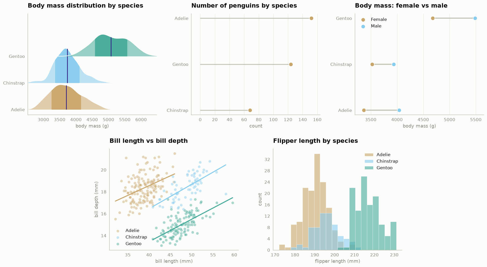

# simple-eda

A tiny, modern charting library built on **matplotlib** and **pandas** — nothing
else. The core is a single compact module with a colorblind-safe palette and
clean, chartjunk-free defaults. It gives you five chart helpers straight from a
DataFrame without the usual matplotlib boilerplate — including three you'd
normally have to hand-build: **lollipop**, **dumbbell**, and **ridgeline**.



## Why

Default matplotlib looks dated and takes a dozen lines to tidy up. `simple_eda`
applies a modern theme (no chartjunk, hairline gridlines, a validated
categorical palette) and gives you chart functions that each take a pandas
object and return the `Axes` for further tweaking.

## Layout

```
simple-eda-project/
├── src/
│   └── simple_eda/
│       ├── __init__.py      # public API
│       └── core.py          # the chart functions + theme
├── examples/
│   ├── example.py           # renders the gallery above
│   └── gallery.png
├── README.md
├── pyproject.toml
└── LICENSE
```

## Install

```bash
pip install -e .          # from the project root
```

This pulls in matplotlib and pandas.

## Usage

```python
import pandas as pd
import simple_eda as se

se.set_theme()   # call once to apply the modern look

counts = pd.Series([152, 124, 68], index=["Adelie", "Gentoo", "Chinstrap"])

ax = se.lollipop(counts, title="Penguins by species")
ax.figure.savefig("counts.png")
```

## Functions

Every function returns a matplotlib `Axes`. Pass `ax=` to draw into an existing
subplot. A legend is added automatically only when there is more than one series.

| Function | Purpose | Input |
|----------|---------|-------|
| `set_theme()` | Apply the modern default style globally | — |
| `scatter(data, x, y, color=None, trend=False, ...)` | Scatter, optionally split by a category; `trend=True` adds a per-group line of best fit | DataFrame |
| `hist(data, column=None, by=None, bins=20, ...)` | Distribution of a column; `by=` overlays one translucent histogram per group | DataFrame / Series |
| `lollipop(data, sort=True, ...)` | Ranked lollipop for categories | DataFrame / Series |
| `dumbbell(data, sort=True, ...)` | Two dots + connector per row (A vs B) | 2-column DataFrame |
| `ridgeline(data, value, group, center="median", band=None, overlap=1.3, ...)` | Overlapping distribution per group; `center` marks the mean/median, `band` shades ±1 SD or the IQR | DataFrame |

Common keyword args: `title`, `xlabel`, `ylabel`, `ax`.

### The signature three

- **`lollipop`** — ranked categories with far less ink than bars; sorted descending
  by default. Takes a Series or one-column DataFrame.
- **`dumbbell`** — a before/after or A-vs-B comparison. Pass a DataFrame with
  exactly two numeric columns; each becomes one dot colour and a legend entry.
- **`ridgeline`** — the shape of a numeric variable across categories, as smoothed
  (Gaussian-KDE) curves stacked and gently overlapped, ordered by median. Pass the
  `value` and `group` column names.

`PALETTE` is the exported list of series colours, assigned in fixed order. The
first three — tan, light blue, teal — carry most charts; the remainder are Paul
Tol's colorblind-safe *muted* hues as fallbacks for higher series counts.

## Example

The gallery above is built entirely from the **Palmer Penguins** dataset
(`examples/penguins.csv`) — a body-mass ridgeline, a species-count lollipop, a
female-vs-male dumbbell, a bill-length-vs-depth scatter, and a flipper-length
histogram. Run it end to end:

```bash
python examples/example.py   # writes examples/gallery.png
```
